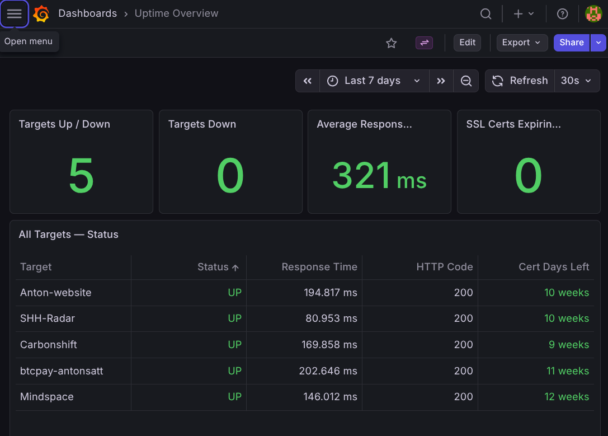

# are-we-up

<p align="center">
  
</p>

Self-hostable uptime monitoring stack. Define your targets in one YAML file, run `docker compose up`, and get dashboards with alerting out of the box.

Built on Prometheus + Grafana + Alertmanager + Blackbox Exporter.

## Quick Start

```bash
# 1. Clone the repo
git clone https://github.com/AntonSatt/are-we-up.git
cd are-we-up

# 2. Create your .env file (optional — only needed for alerting)
cp .env.example .env
# Edit .env with your notification credentials

# 3. Add your targets
# Edit targets.yml — add the sites and services you want to monitor

# 4. Start the stack
docker compose up -d --build
```

Open [http://localhost:3000](http://localhost:3000) for Grafana (default login: `admin`/`admin`).

## Services

| Service           | Port  | URL                           |
|-------------------|-------|-------------------------------|
| Grafana           | 3000  | http://localhost:3000         |
| Prometheus        | 9090  | http://localhost:9090         |
| Alertmanager      | 9093  | http://localhost:9093         |
| Blackbox Exporter | 9115  | http://localhost:9115         |
| Node Exporter     | 9100  | http://localhost:9100/metrics |
| cAdvisor          | 8080  | http://localhost:8080         |

All ports are configurable via `.env`.

## Adding Targets

Edit `targets.yml` to add or remove monitoring targets. Prometheus picks up changes automatically within 30 seconds — no restart needed.

### HTTP/HTTPS Sites

```yaml
- targets:
    - https://your-site.com
  labels:
    name: your-site
    module: http_2xx
```

### TCP Services

```yaml
- targets:
    - your-db-host:5432
  labels:
    name: postgres
    module: tcp_connect
```

### ICMP Ping

```yaml
- targets:
    - 8.8.8.8
  labels:
    name: google-dns
    module: icmp
```

### Available Modules

| Module           | Description                              |
|------------------|------------------------------------------|
| `http_2xx`       | HTTPS probe with TLS validation          |
| `http_2xx_no_tls`| HTTP probe, skips TLS verification       |
| `tcp_connect`    | TCP connection check                     |
| `icmp`           | ICMP ping (requires container privileges)|

## Dashboards

Five pre-built dashboards are provisioned automatically:

- **Uptime Overview** — all targets at a glance: status, response time, uptime history, SSL cert expiry
- **Site Detail** — per-site deep-dive with response time breakdown (DNS, TCP, TLS, processing, transfer), status code history, SSL countdown
- **System Overview** — CPU, memory, disk, network from Node Exporter
- **Docker Containers** — per-container CPU, memory, network, disk I/O with summary table
- **Stack Health** — Prometheus self-monitoring: scrape targets, memory, storage, query performance, alert status

## Alerting

Alerts are pre-configured and fire when:

| Alert                  | Condition                                  | Severity |
|------------------------|--------------------------------------------|----------|
| TargetDown             | Probe fails for 2 minutes                  | critical |
| HighResponseTime       | Response > 3s for 5 minutes                | warning  |
| SSLCertExpiringSoon    | SSL cert expires in < 14 days              | warning  |
| SSLCertExpiryCritical  | SSL cert expires in < 3 days               | critical |
| HTTPStatusCodeChange   | Non-200 response for 5 minutes             | warning  |
| HighCPUUsage           | CPU > 85% for 10 minutes                   | warning  |
| HighMemoryUsage        | Memory > 85% for 10 minutes                | warning  |
| DiskSpaceLow           | Disk > 85% full for 10 minutes             | warning  |
| DiskSpaceCritical      | Disk > 95% full for 5 minutes              | critical |
| PrometheusTargetMissing| Scrape target down for 5 minutes           | warning  |

### Notification Channels

Configure in `.env`:

**Discord** — set `DISCORD_WEBHOOK_URL`. Alerts are sent via a built-in bridge service that translates Alertmanager alerts into Discord embeds. Optionally set `DISCORD_MENTION_USER_ID` to get pinged on firing alerts (enable Developer Mode in Discord, right-click your name, Copy User ID).

To add other notification channels, edit `alertmanager/alertmanager.yml.tmpl` and add the corresponding receivers (Slack, email, generic webhook, etc). See the [Alertmanager documentation](https://prometheus.io/docs/alerting/latest/configuration/) for receiver configuration.

## Configuration Reference

### Environment Variables

| Variable              | Default             | Description                    |
|-----------------------|---------------------|--------------------------------|
| `PROMETHEUS_PORT`     | 9090                | Prometheus UI port             |
| `GRAFANA_PORT`        | 3000                | Grafana UI port                |
| `ALERTMANAGER_PORT`   | 9093                | Alertmanager UI port           |
| `BLACKBOX_PORT`       | 9115                | Blackbox Exporter port         |
| `NODE_EXPORTER_PORT`  | 9100                | Node Exporter port             |
| `CADVISOR_PORT`       | 8080                | cAdvisor port                  |
| `PROMETHEUS_RETENTION`| 30d                 | How long to keep metrics       |
| `GRAFANA_ADMIN_USER`  | admin               | Grafana admin username         |
| `GRAFANA_ADMIN_PASSWORD`| admin             | Grafana admin password         |
| `DISCORD_WEBHOOK_URL` | —                   | Discord webhook URL            |
| `DISCORD_MENTION_USER_ID` | —               | Discord user ID to ping on firing alerts |

### File Structure

```
are-we-up/
├── docker-compose.yml           # Stack orchestration
├── .env.example                 # Environment variable template
├── targets.yml                  # Your monitoring targets
├── prometheus/
│   ├── prometheus.yml           # Prometheus configuration
│   └── alert-rules.yml          # Alerting rules
├── alertmanager/
│   ├── alertmanager.yml.tmpl    # Notification routing template
│   └── entrypoint.sh            # Config preprocessor
├── discord-bridge/
│   ├── bridge.py                # Alertmanager-to-Discord translator
│   └── Dockerfile
├── blackbox-exporter/
│   └── blackbox.yml             # Probe configurations
└── grafana/
    ├── provisioning/            # Auto-provisioning configs
    └── dashboards/              # JSON dashboard definitions
```

## Stopping

```bash
docker compose down          # Stop containers (keeps data)
docker compose down -v       # Stop and delete all data
```
