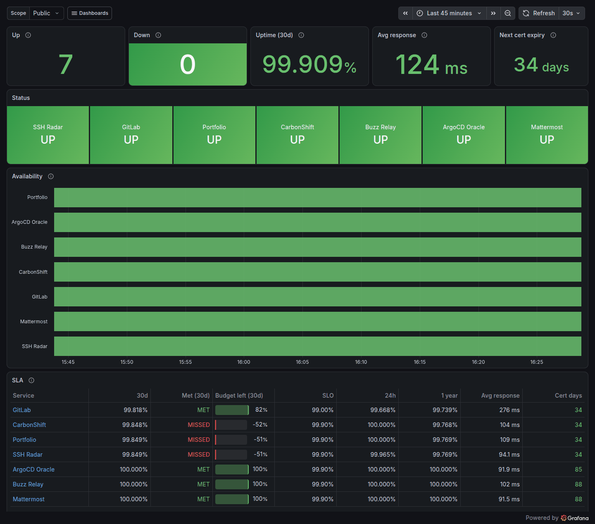

# are-we-up

<p align="center">
  
</p>

Self-hostable uptime monitoring stack. Define your targets in one YAML file, run `docker compose up`, and get dashboards with alerting out of the box.

Built on Prometheus + Grafana + Alertmanager + Blackbox Exporter.

## Quick Start

```bash
# 1. Clone the repo
git clone https://github.com/AntonSatt/are-we-up.git
cd are-we-up

# 2. Create your .env file (optional — only needed for alerting)
cp .env.example .env
# Edit .env with your notification credentials

# 3. Add your targets
# Edit prometheus/targets.yml — add the sites and services you want to monitor

# 4. Start the stack
docker compose up -d --build
```

Open [http://localhost:3000](http://localhost:3000) for Grafana (default login: `admin`/`admin`).

## Services

| Service           | Port  | URL                           |
|-------------------|-------|-------------------------------|
| Grafana           | 3000  | http://localhost:3000         |
| Prometheus        | 9090  | http://localhost:9090         |
| Alertmanager      | 9093  | http://localhost:9093         |
| Blackbox Exporter | 9115  | http://localhost:9115         |
| Node Exporter     | 9100  | http://localhost:9100/metrics |
| cAdvisor          | 8080  | http://localhost:8080         |

All ports are configurable via `.env`.

## Adding Targets

Edit `prometheus/targets.yml` to add or remove monitoring targets. Prometheus picks up changes automatically within 30 seconds — no restart needed.

### HTTP/HTTPS Sites

```yaml
- targets:
    - https://your-site.com
  labels:
    name: your-site
    module: http_2xx
```

### TCP Services

```yaml
- targets:
    - your-db-host:5432
  labels:
    name: postgres
    module: tcp_connect
```

### ICMP Ping

```yaml
- targets:
    - 8.8.8.8
  labels:
    name: google-dns
    module: icmp
```

### Private Targets

Targets on a LAN or tailnet shouldn't end up in a public repo. Put them in
`targets.d/*.yml` instead (same format as `prometheus/targets.yml`): every real file in
that directory is gitignored, only `targets.d/private.yml.example` is tracked.
They are scraped as job `blackbox-private`, and the **Scope** picker in the
Uptime Overview switches between *All*, *Public* and *Private*.

```bash
cp targets.d/private.yml.example targets.d/private.yml   # then edit
```

### Available Modules

| Module           | Description                              |
|------------------|------------------------------------------|
| `http_2xx`       | HTTPS probe with TLS validation          |
| `http_2xx_no_tls`| HTTP probe, skips TLS verification       |
| `http_auth_no_tls`| Like `http_2xx_no_tls`, but 401 counts as up (service behind basic auth) |
| `tcp_connect`    | TCP connection check                     |
| `icmp`           | ICMP ping (requires container privileges)|

### SLO Targets (optional)

Add an `slo` label to any target to set its SLO percentage. The **SLA / Reliability** dashboard uses it to compute per-target error budget and a MET/MISSED badge.

```yaml
- targets:
    - https://your-site.com
  labels:
    name: your-site
    module: http_2xx
    slo: "99.95"
```

Supported values: `"99"`, `"99.9"` (default if omitted), `"99.95"`, `"99.99"`. Other values silently fall back to the default.

## Dashboards

Six pre-built dashboards are provisioned automatically:

- **Uptime Overview** — headline numbers, a status tile per service, an availability timeline (red where a probe failed) and an SLA table with 30-day MET/MISSED, error budget and cert days; filter by *All / Public / Private*
- **SLA / Reliability** — uptime % across 24h/30d/1y windows, error budget remaining (per-target), status timeline, downtime summary
- **Site Detail** — per-site deep-dive with response time breakdown (DNS, TCP, TLS, processing, transfer), status code history, SSL countdown
- **System Overview** — CPU, memory, disk, network from Node Exporter
- **Docker Containers** — per-container CPU, memory, network, disk I/O with summary table
- **Stack Health** — Prometheus self-monitoring: scrape targets, memory, storage, query performance, alert status

## Alerting

Alerts are pre-configured and fire when:

| Alert                  | Condition                                  | Severity |
|------------------------|--------------------------------------------|----------|
| TargetDown             | Probe fails for 2 minutes                  | critical (`page` tier), else warning |
| HighResponseTime       | Response > 3s for 5 minutes                | warning  |
| SSLCertExpiringSoon    | SSL cert expires in < 14 days              | warning  |
| SSLCertExpiryCritical  | SSL cert expires in < 3 days (`page` tier) | critical |
| HTTPStatusCodeChange   | Non-200 response for 5 minutes             | warning  |
| HighCPUUsage           | CPU > 85% for 10 minutes                   | warning  |
| HighMemoryUsage        | Memory > 85% for 10 minutes                | warning  |
| DiskSpaceLow           | Disk > 85% full for 10 minutes             | warning  |
| DiskSpaceCritical      | Disk > 95% full for 5 minutes              | critical |
| PrometheusTargetMissing| Scrape target down for 5 minutes           | warning  |

Alerts about the same thing are grouped into one notification (one message
for every target that is down, not one per target), a down target does not
also report as slow, and a critical alert covers the matching warning (e.g.
`DiskSpaceCritical` over `DiskSpaceLow`).

### Alert Tiers

Not every target deserves a ping. Each target has a tier, keyed on its `name`:

| Tier     | Probe alerts                        | Set in                   |
|----------|-------------------------------------|--------------------------|
| `page`   | critical: Discord with a mention    | `alert_tier` rule        |
| (none)   | warning: Discord without a mention  | default, nothing to set  |
| `off`    | none, dashboards only               | `alert_tier` rule        |

Tiers live in `alert_tier` recording rules at the top of
`prometheus/alert-rules.yml` instead of as target labels, because changing a
target's labels starts new series and resets its SLA history. Tiers for
private targets go in `rules.d/*.yml` (gitignored like `targets.d/`):

```bash
cp rules.d/private.yml.example rules.d/private.yml   # then edit
```

### Notification Channels

Configure in `.env`:

**Discord** — set `DISCORD_WEBHOOK_URL`. Alerts are sent via a built-in bridge service that translates Alertmanager alerts into Discord embeds. Optionally set `DISCORD_MENTION_USER_ID` to get pinged on firing critical alerts (enable Developer Mode in Discord, right-click your name, Copy User ID).

To add other notification channels, edit `alertmanager/alertmanager.yml` and add the corresponding receivers (Slack, email, generic webhook, etc). See the [Alertmanager documentation](https://prometheus.io/docs/alerting/latest/configuration/) for receiver configuration.

## Configuration Reference

### Environment Variables

| Variable              | Default             | Description                    |
|-----------------------|---------------------|--------------------------------|
| `PROMETHEUS_PORT`     | 9090                | Prometheus UI port             |
| `GRAFANA_PORT`        | 3000                | Grafana UI port                |
| `ALERTMANAGER_PORT`   | 9093                | Alertmanager UI port           |
| `BLACKBOX_PORT`       | 9115                | Blackbox Exporter port         |
| `NODE_EXPORTER_PORT`  | 9100                | Node Exporter port             |
| `CADVISOR_PORT`       | 8080                | cAdvisor port                  |
| `PROMETHEUS_RETENTION`| 400d                | How long to keep metrics (≥365d required for the 1y SLA) |
| `GRAFANA_ADMIN_USER`  | admin               | Grafana admin username         |
| `GRAFANA_ADMIN_PASSWORD`| admin             | Grafana admin password         |
| `DISCORD_WEBHOOK_URL` | —                   | Discord webhook URL            |
| `DISCORD_MENTION_USER_ID` | —               | Discord user ID to ping on firing critical alerts |

### File Structure

```
are-we-up/
├── docker-compose.yml           # Stack orchestration
├── .env.example                 # Environment variable template
├── targets.d/                   # Private targets, gitignored (*.yml)
├── rules.d/                     # Private alert tiers, gitignored (*.yml)
├── prometheus/
│   ├── targets.yml              # Your monitoring targets (public)
│   ├── prometheus.yml           # Prometheus configuration
│   └── alert-rules.yml          # Alerting rules
├── alertmanager/
│   └── alertmanager.yml         # Notification routing
├── discord-bridge/
│   ├── bridge.py                # Alertmanager-to-Discord translator
│   └── Dockerfile
├── blackbox-exporter/
│   └── blackbox.yml             # Probe configurations
└── grafana/
    ├── provisioning/            # Auto-provisioning configs
    └── dashboards/              # JSON dashboard definitions
```

## Applying Config Changes

Config directories are mounted, not single files, so edits and `git pull` show
up inside the containers right away. Prometheus (targets, rules, config) and the
Blackbox Exporter reload on their own within 30 seconds. Alertmanager has no
auto-reload, so tell it after changing `alertmanager/alertmanager.yml`:

```bash
curl -X POST http://localhost:9093/-/reload
```

Only changes to `docker-compose.yml` itself need `docker compose up -d`.

## Versions and Upgrades

Every image is pinned to an exact version in `docker-compose.yml`, so a
`docker compose pull` never jumps a major version by surprise. To upgrade, bump
the tag, back up the volumes, then pull and recreate:

```bash
docker compose stop prometheus grafana
docker run --rm -v are-we-up_prometheus-data:/src:ro -v "$PWD":/dst alpine \
  tar czf /dst/prometheus-data.tgz -C /src .
docker run --rm -v are-we-up_grafana-data:/src:ro -v "$PWD":/dst alpine \
  tar czf /dst/grafana-data.tgz -C /src .
docker compose pull && docker compose up -d
```

Grafana migrates its database on a major upgrade and cannot go back, so the
Grafana backup is the rollback path.

## Stopping

```bash
docker compose down          # Stop containers (keeps data)
docker compose down -v       # Stop and delete all data
```
